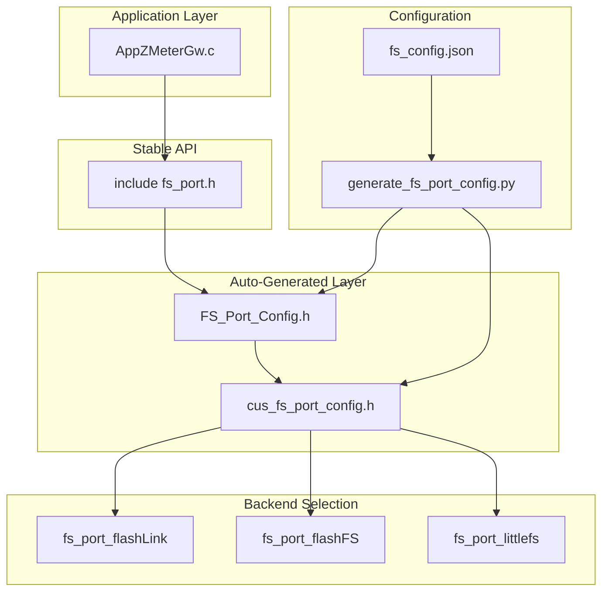
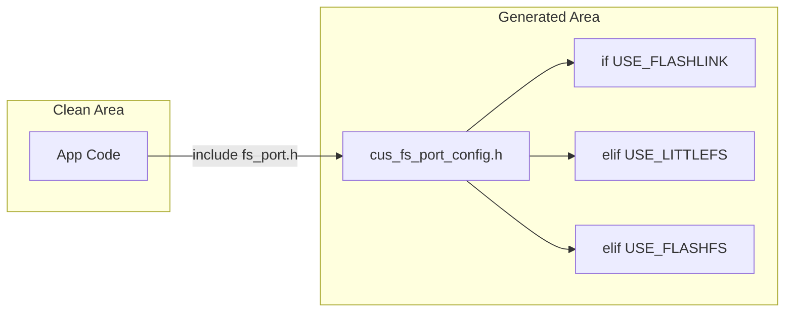
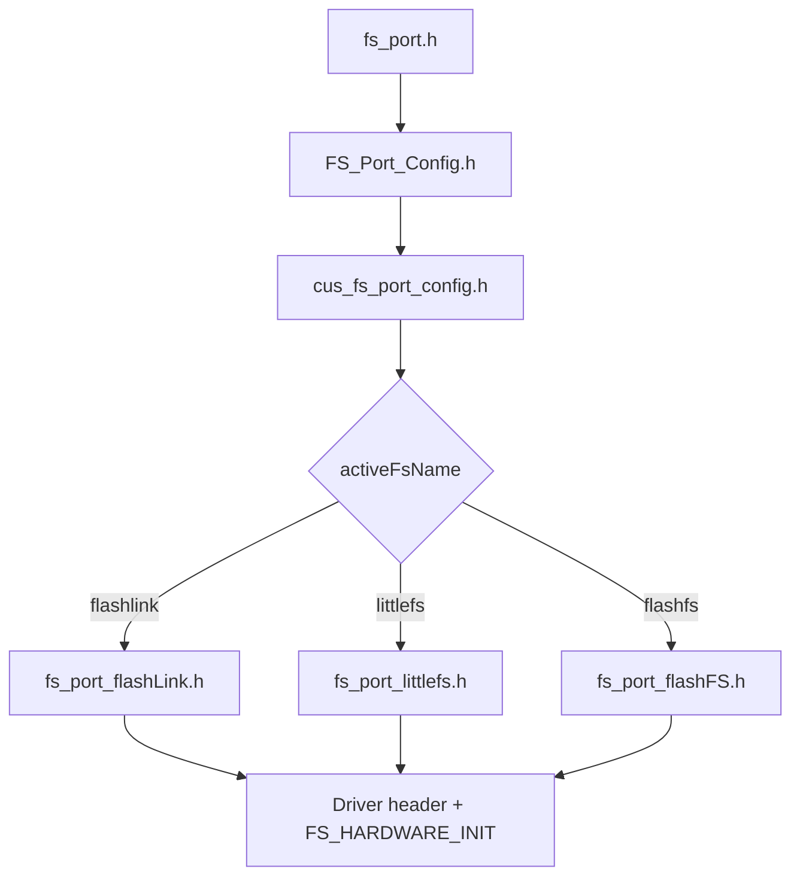
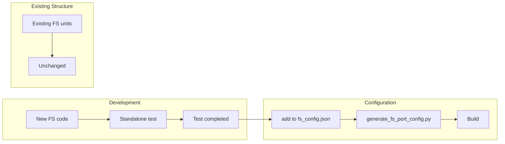
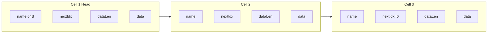
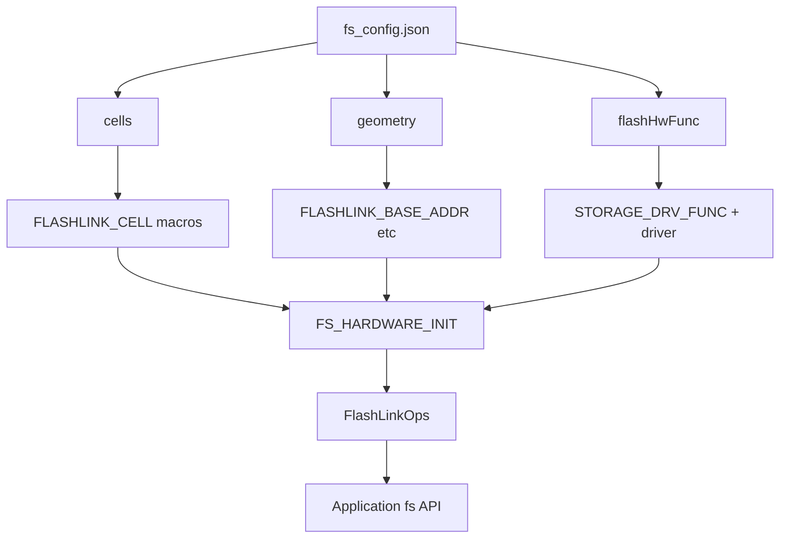
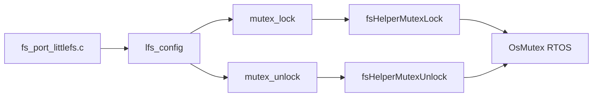
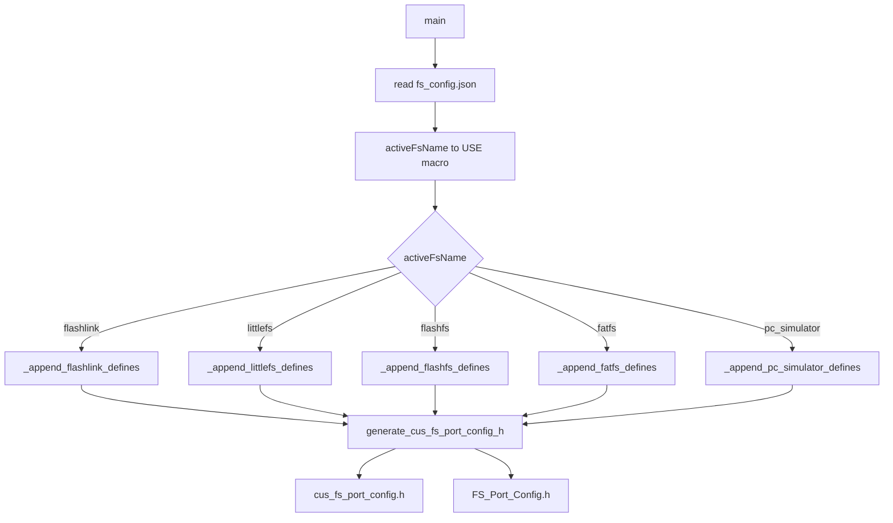
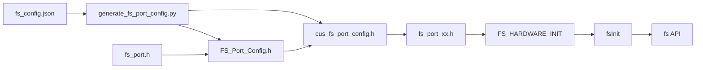

# Aviora File System Framework — Professional Technical Guide

> **Modular File System Platform — Customer and Platform Independent, No `#if/#else` in Code**

This document describes the file system architecture used in the Aviora project, design decisions, and technical details. Target audience: integration team, managers, and technical sales processes.

---

## Executive Summary

Aviora FS Framework offers a **fully modular** architecture that supports multiple file system backends through **a single stable API**. Application code contains no preprocessor branching like `#if defined(USE_FLASHLINK)`. Customer- and platform-specific selection is done via JSON configuration files and integrated into the project through pre-build automatic code generation.

### Key Benefits

| Benefit | Description |
|---------|-------------|
| **Single API Surface** | Developers include `fs_port.h`, call `FS_HARDWARE_INIT` and `fsInit`; the same code runs regardless of backend |
| **Configuration-Driven** | Customer selects backend via `activeFsName`; behavior is tuned with `cells`, `geometry`, `flashHwFunc` |
| **Tested Units** | New FS unit is developed and tested externally; added to the project via configuration; existing structure remains untouched |
| **Hardware Independence** | read/prog/erase/sync callbacks are injected from JSON via `flashHwFunc`; same FS runs on different MCUs |

---

## Architecture Overview



---

## 1. Modular Design — Why No `#if/#else`?

### Developer Perspective

Application code uses a single include and a fixed startup sequence:

```c
#include "Middleware/MiddComm/Midd_FS/fs_port.h"

// At startup:
FS_HARDWARE_INIT(error);
if (NO_ERROR != error) { /* handle error */ }
error = fsInit();
if (NO_ERROR != error) { /* handle error */ }
DEBUG_INFO("->[I] %s fs ready", FS_NAME);

// Afterwards:
FsFile *f = fsOpenFile("config.bin", FS_FILE_MODE_READ);
fsReadFile(f, buf, sizeof(buf), &len);
fsCloseFile(f);
```

Developers do **not** know which file system is active; they only use the `fs*` API.

### Where Is the Preprocessor Branching?

The `#if/#elif` blocks exist **only** in the auto-generated `cus_fs_port_config.h`. Developers do not edit this file manually; it is derived from JSON. Thus:

- Application modules stay clean
- Change scope is concentrated in one place
- Adding a new backend means adding a branch and `_append_*` function to the generator script



---

## 2. Customer-Based Configuration Structure

### Directory Layout

Each customer has its own directory with JSON configuration files per unit. For the file system:

```
Customers/
├── ZD_0101/
│   └── Fs/
│       ├── fs_config.json        ← Source (edited manually)
│       └── cus_fs_port_config.h  ← Generated (do not edit)
├── ZD_2622/
│   └── Fs/
│       ├── fs_config.json
│       └── cus_fs_port_config.h
└── FS_Port_Config.h              ← Generated; includes active customer
```

### fs_config.json Structure

```json
{
  "customer": "ZD_0101",
  "version": 1.1,
  "releaseDate": "2026-03-20",
  "store": {
    "useStore": true,
    "activeFsName": "flashlink",
    "fsLib": {
      "flashlink": { ... },
      "littlefs": { ... },
      "flashfs": { ... },
      "fatfs": { ... },
      "pc_simulator": { ... }
    }
  }
}
```

| Key | Description |
|-----|-------------|
| `useStore` | If `false`, FS is not used → `#error USE_NOT_USED_FS` |
| `activeFsName` | Active backend name (`flashlink`, `littlefs`, `flashfs`, etc.) |
| `fsLib` | Parameters per backend; only the block matching `activeFsName` is used |

---

## 3. Include Chain and Automatic Inclusion

### A Single Include Is Enough

In a C file, **only** this line is written:

```c
#include "Middleware/MiddComm/Midd_FS/fs_port.h"
```

This file:

1. Defines common types (`FsFileStat`, `FsDirEntry`, `FsFileMode`, etc.)
2. At the end, includes `#include "../../../Customers/FS_Port_Config.h"`
3. `FS_Port_Config.h` → `#include "ZD_2622/Fs/cus_fs_port_config.h"` (example customer)
4. `cus_fs_port_config.h` → `#define USE_FLASHLINK 1` and `#include "fs_port_flashLink.h"`
5. FlashLink port includes the HW driver and `FS_HARDWARE_INIT` macro



---

## 4. Tested Units — Development Cycle

### Goal

Use JSON-based configuration to include or exclude **previously written and tested** code according to customer needs. Only tested units are used.

### New FS Development Process



- New FS: Developed and tested independently from the project
- After test completion, `fs_config.json` and generator are updated
- Existing structure is not used during development; regression risk is minimized

---

## 5. FlashLink — Lightweight Linked-Cell Storage

### Concept

FlashLink is a very small footprint file system that runs in the processor's **own internal flash**. It does not require external flash; ideal for customers with small storage needs.

### Cell Design

Each file is represented by one or more **cells**. Cells are linked in a chain:



**Cell header layout:**

| Field | Size | Description |
|-------|------|-------------|
| `name` | 64 B (from config) | ASCII, null terminated, 0xFF when cell is unused |
| `nextIndex` | 2 B | Stored as ~nextIndex; 0xFFFF = last cell |
| `dataLen` | 2 B | Stored as ~dataLen; data length in this cell |

### cells, geometry, flashHwFunc — Flexibility Points

#### 1. cells

```json
"cells": {
  "cellSize": 1024,
  "nameSize": 64,
  "cellDataSize": 956,
  "cellCount": 10
}
```

- `cellSize`: Total byte size per cell
- `nameSize`: File name field (in header)
- `cellDataSize`: Usable data area per cell
- `cellCount`: Total number of cells

These values become generated macros: `FLASHLINK_CELL_SIZE`, `FLASHLINK_NAME_SIZE`, `FLASHLINK_CELL_DATA_SIZE`, `FLASHLINK_CELL_COUNT`.

#### 2. geometry

```json
"geometry": {
  "baseAddr": "0x080A0000",
  "regionSize": 131072,
  "eraseBlockSize": 4096
}
```

- `baseAddr`: Start address of flash region
- `regionSize`: Total region size (bytes)
- `eraseBlockSize`: Minimum erase unit (e.g. sector size)

#### 3. flashHwFunc

```json
"flashHwFunc": {
  "drvSrcPath": "Driver/McuCoreDrivers/inc/McuInternalFlashDrv_Stm32f407.h",
  "readFunc": "internalStm32f407FlashRead",
  "writeFunc": "internalStm32f407FlashProg",
  "eraseFunc": "internalStm32f407FlashErase",
  "syncFunc": "internalStm32f407FlashSync"
}
```

This block injects **hardware-specific** read/write/erase/sync functions from JSON. The same FlashLink code runs on different MCUs with different drivers; only the path and function names in JSON need to change.



---

## 6. FlashFS — Mini Append-Only Log File System

### Concept

FlashFS is a very simple **append-only log** file system. It runs in internal flash; targets low complexity and small code size.

### Design Features

- **Superblock**: Magic, version, geometry
- **Log records**: FILE (create/write), DELETE, RENAME
- **No GC**: Format required when region is full
- **Index at mount**: Log is read and an in-memory index is built


### geometry and flashHwFunc

For FlashFS, `geometry`:

```json
"geometry": {
  "baseAddr": "0x080A0000",
  "totalSize": 131072,
  "eraseBlockSize": 4096,
  "progMinSize": 1024
}
```

`flashHwFunc` works like FlashLink; read/prog/erase/sync callbacks are injected from JSON.

---

## 7. littlefs and fs_littlefs_helper_func — Why It Exists

### littlefs Integration

littlefs is a popular embedded file system. In Aviora it is ported to the CycloneTCP-compatible `fs*` API via `fs_port_littlefs.c`.

littlefs expects **mutex lock/unlock** callbacks for thread-safe access. These callbacks depend on the RTOS or bare-metal environment.

### Role of fs_littlefs_helper_func.h/.c

The `fs_littlefs_helper_func` module provides:

| Function | Description |
|----------|-------------|
| `fsHelperMutexCreate()` | Creates mutex; suitable for static init before kernel start |
| `fsHelperMutexDelete()` | Deletes mutex |
| `fsHelperMutexLock(const struct lfs_config *c)` | Called from lfs config; critical section enter |
| `fsHelperMutexUnlock(const struct lfs_config *c)` | Critical section exit |

These functions are wired via the `osHelper` block in `fs_config.json`:

```json
"osHelper": {
  "path": "Middleware/MiddComm/Midd_FS/fs/fs_littlefs_helper_func.h",
  "mutexCreate": "fsHelperMutexCreate",
  "mutexDelete": "fsHelperMutexDelete",
  "mutexLock": "fsHelperMutexLock",
  "mutexUnlock": "fsHelperMutexUnlock"
}
```

When `USE_LITTLEFS` is active, the generator includes this path and emits `LITTLEFS_MUTEX_*` macros.

### Usage

In `fs_port_littlefs.c`:

```c
g_lfsCfg.mutex_lock = LITTLEFS_MUTEX_LOCK;
g_lfsCfg.mutex_unlock = LITTLEFS_MUTEX_UNLOCK;
```

littlefs calls these callbacks around each block I/O. Critical for race-free access in RTOS-based products.



---

## 8. generate_fs_port_config.py — Code Generator Architecture

### General Flow



### Usage

```bash
python Customers/generate_fs_port_config.py --customer ZD_2622
```

### Input / Output

| Input | `Customers/<customer>/Fs/fs_config.json` |
|-------|------------------------------------------|
| Output 1 | `Customers/<customer>/Fs/cus_fs_port_config.h` |
| Output 2 | `Customers/FS_Port_Config.h` |

### Example: activeFsName = "flashlink"

When the generator runs, example console output:

```
SELECTED FS NAME: flashlink
--------------------------------
cell_size: 1024
name_size: 64
...
--------------------------------
Generated cus_fs_port_conf: .../cus_fs_port_config.h
Generated FS_Port_Conf: .../FS_Port_Config.h
```

Content of `cus_fs_port_config.h`:

- `#define USE_FLASHLINK 1`
- `#include "fs_port_flashLink.h"`
- `#include "Driver/McuCoreDrivers/inc/McuInternalFlashDrv_Stm32f407.h"`
- `#define FLASHLINK_CELL_SIZE 1024` etc.
- `#define STORAGE_DRV_FUNC_READ internalStm32f407FlashRead` etc.
- `#define FS_HARDWARE_INIT(error_out) do { ... } while (0)`

### Example: activeFsName = "littlefs"

- `#define USE_LITTLEFS 1`
- `#include "fs_port_littlefs.h"`
- `#define LITTLEFS_GEOMETRY_*` macros
- `#include "fs_littlefs_helper_func.h"`
- `#define LITTLEFS_MUTEX_*` macros
- `#define FS_HARDWARE_INIT(error_out)` → Storage_Init + mutex create

---

## 9. Midd_FS Directory — File Inventory

| File | Role |
|------|------|
| `fs_port.h` | Common API types; includes `FS_Port_Config.h` |
| `fs/fs_port_flashLink.h` | FlashLink API and type definitions |
| `fs/fs_port_flashLink.c` | FlashLink implementation |
| `fs/fs_port_flashFS.h` | FlashFS API |
| `fs/fs_port_flashFS.c` | FlashFS implementation |
| `fs/fs_port_littlefs.h` | littlefs port API |
| `fs/fs_port_littlefs.c` | littlefs port implementation |
| `fs/fs_littlefs_helper_func.h` | littlefs mutex callback declarations |
| `fs/fs_littlefs_helper_func.c` | Mutex create/lock/unlock implementation (with RTOS) |
| `drivers/StorageFlashPort_littlefs.h` | littlefs block device declarations |
| `drivers/StorageFlashPort_littlefs.c` | Block device I/O (Storage_Init, Read, Prog, Erase, Sync) |
| `fs/test_fs_port_flashLink.c` | FlashLink test code |

---

## 10. Visual Assets


| File | Content |
|------|---------|
| `include_chain.gif` | Include chain flow |
| `generator_flow.gif` | Generator pipeline steps |
| `flashlink_layout.gif` | FlashLink cell layout and chain |
| `flashfs_log_layout.gif` | FlashFS superblock and log records |
| `generator_flashlink_ZD_2622.gif` | Generator output for ZD_2622 + flashlink |
| `generator_littlefs_simulated.gif` | littlefs scenario simulation |

---

## Summary Diagram



---

*Designed by Zafer Satılmış | Aviora File System Framework*
