# Aviora ZMeter Gateway — Protocol Layer (Professional Guide)

> **JSON-over-TCP between device and head-end: push channel for outbound events, pull channel for inbound commands.**

This document describes the protocol stack under `Application/AppZMeterGw/Services/Protocol`: responsibilities, message types, state machines, and integration with meter jobs. Audience: firmware engineers, integration, and technical documentation.

---

## Executive Summary

| Topic | Summary |
|--------|---------|
| **Transport** | TCP; all payloads are JSON text |
| **Channels** | **Push** — device connects to server; **Pull** — server connects to device’s local port |
| **Core modules** | `AppTcpConnManager`, `AppMeterOperations`, `AppProtocolZD` |
| **Persistence** | Registration flag, optional server address override, meter/directive files on FS |
| **Test tool** | Python Tkinter server in `Protocol/server/server.py` |

---

## 1. Repository layout

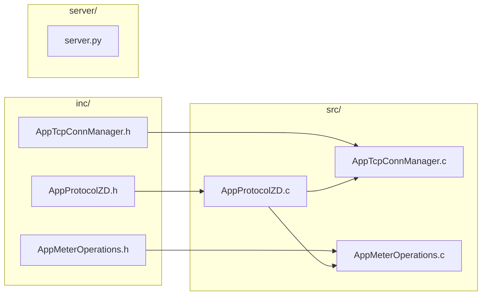

---

## 2. Logical architecture

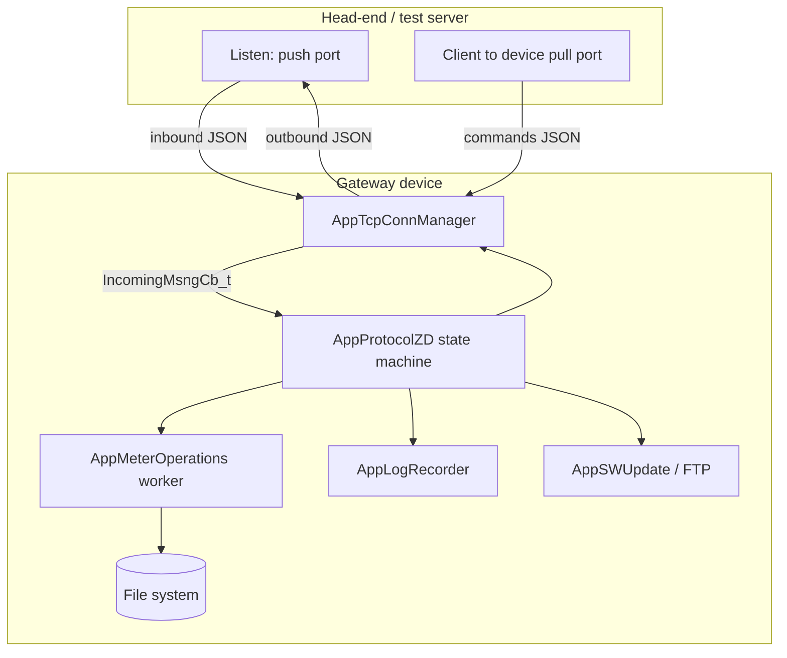

---

## 3. Push vs pull (conceptual)

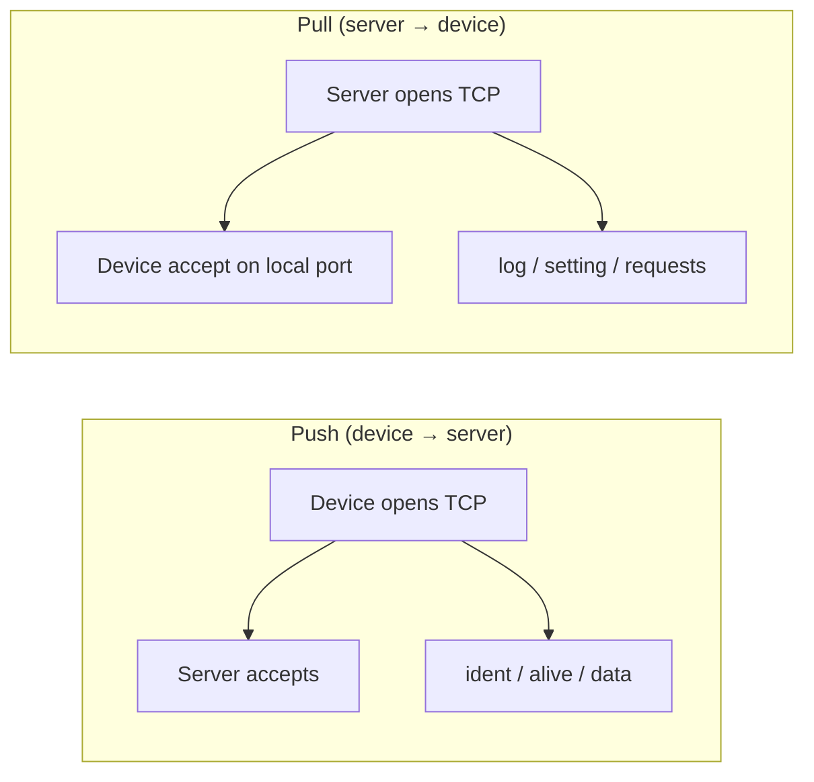

| Channel | TCP direction | Typical `function` values |
|---------|----------------|---------------------------|
| Push | Device is client | `ident`, `alive`, `readout`, `loadprofile` (data) |
| Pull | Device is server | `log`, `setting`, `fwUpdate`, `readout` (request), `loadprofile`, `directiveList`, `directiveAdd`, `directiveDelete` |

Every JSON message includes a **device header**:

```json
"device": { "flag": "AVI", "serialNumber": "0123456789ABCDE" }
```

---

## 4. AppTcpConnManager — connection lifecycle

The TCP thread multiplexes pull listener, pull client sockets, and push client with `select()`.

`appTcpConnManagerStart(serverIP, serverPort, pullPort, incomingMsngCb)` stores the callback **`IncomingMsngCb_t`**: `void (*IncomingMsngCb_t)(const char *channel, const char *data, unsigned int dataLength)`. On each receive, the thread calls `incomingMsngCb` with channel `"push"` or `"pull"` (`PUSH_TCP_SOCK_NAME` / `PULL_TCP_SOCK_NAME`). **AppProtocolZD** passes `appProtocolZDPutIncomingMessage`; any other protocol module can register its own handler the same way.

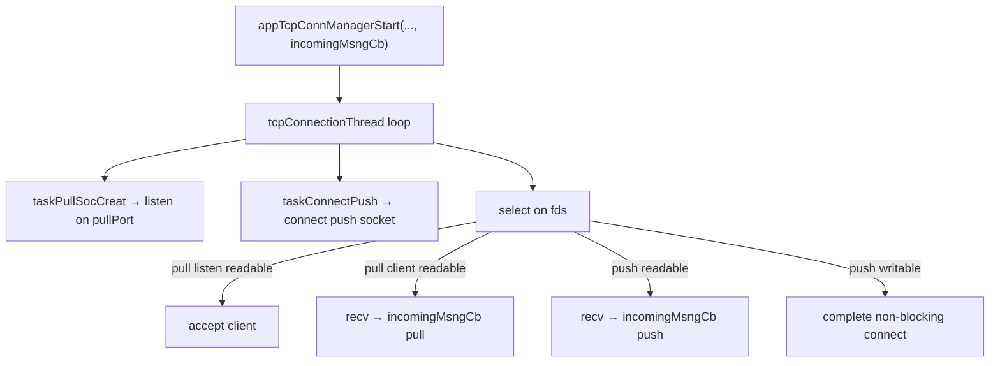

Non-blocking connect is used for push until established, then blocking mode for send/receive.

---

## 5. AppMeterOperations — data paths

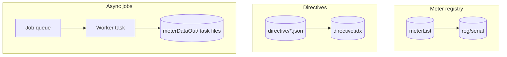

Readout and load profile jobs write:

- `<taskId>_meterID.txt`
- `<taskId>_readout.txt` or `<taskId>_payload.txt`

Protocol reads these files after the callback and sends them on **push**, then deletes the files.

---

## 6. AppProtocolZD — registration and main loop (state view)

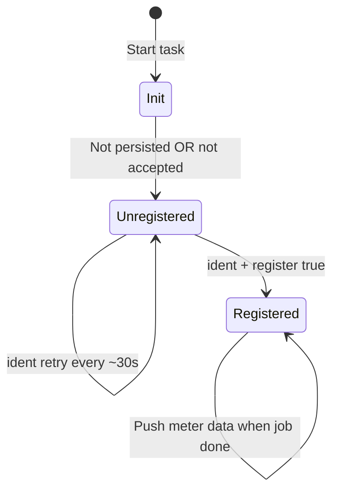

---

## 7. Sequence: first registration (ident)

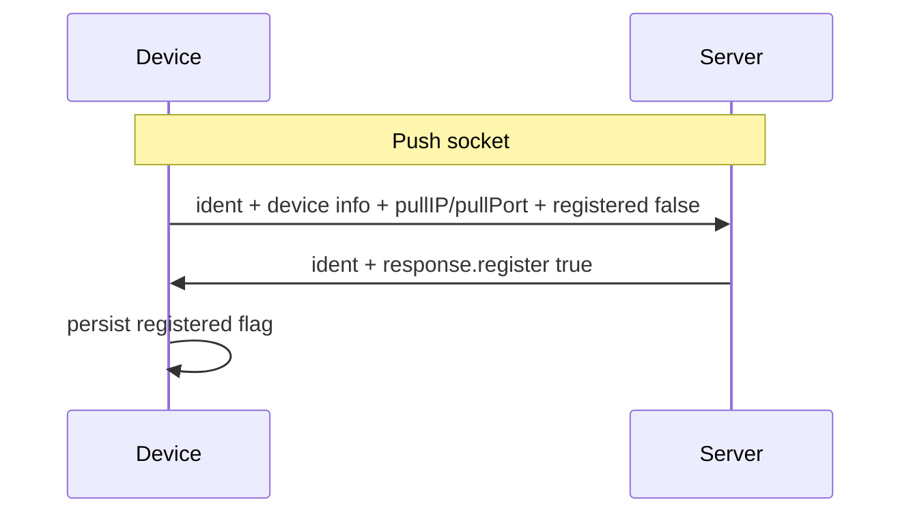

If the device was already registered (persisted), it may send `registered: true` in the ident payload per product rules.

---

## 8. Sequence: alive

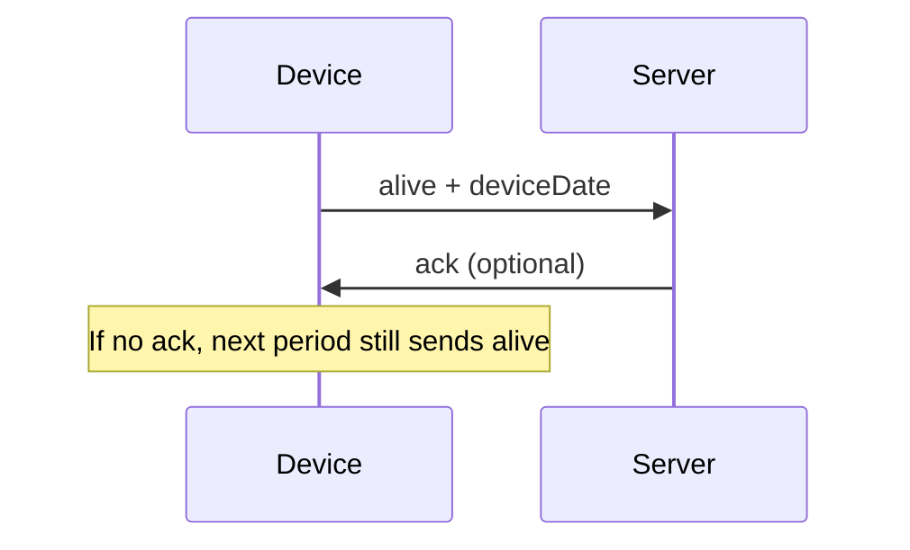

---

## 9. Sequence: log request (pull, may stream)

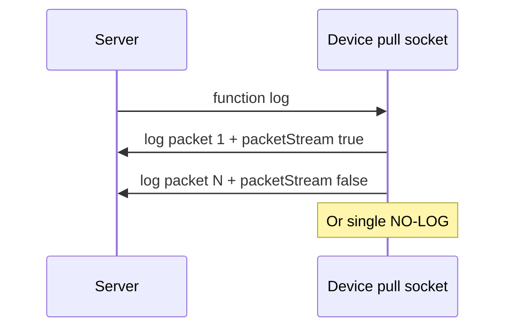

Packets are capped around **1024 bytes** JSON total; application splits payload into chunks with `packetNum` / `packetStream`.

---

## 10. Sequence: setting (server + meters)

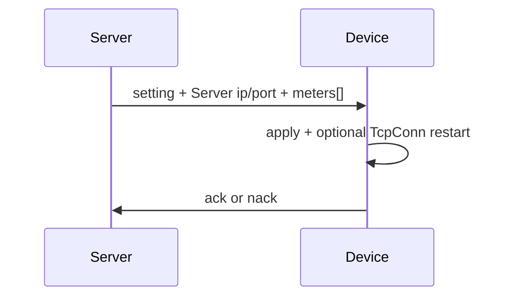

---

## 11. Sequence: readout (pull request → push data)

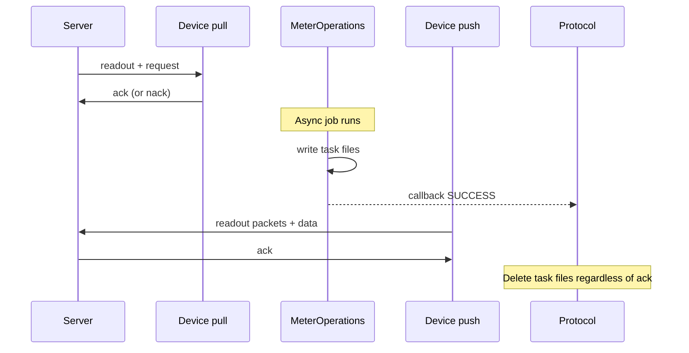

---

## 12. Sequence: firmware update

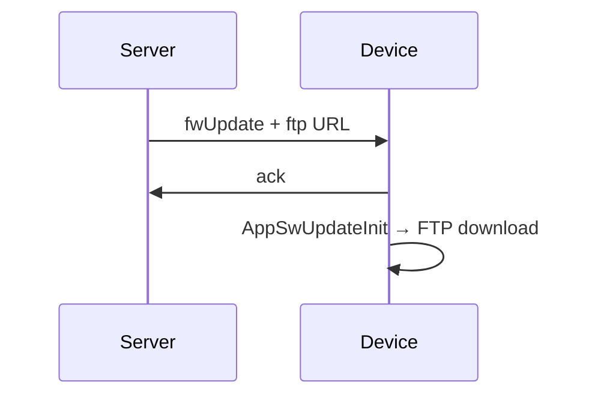

---

## 13. Directive management (pull)

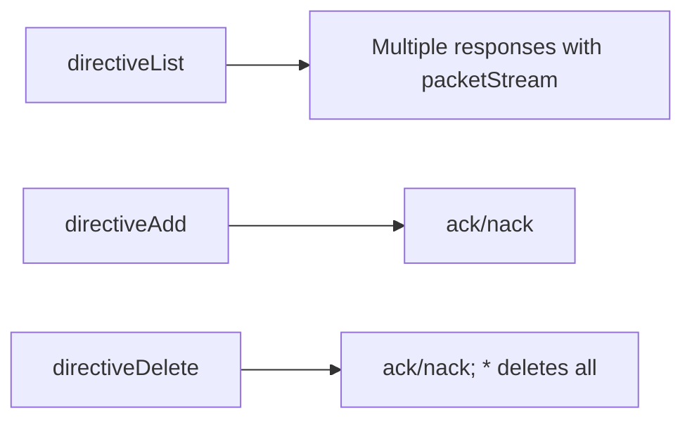

---

## 14. JSON framing on TCP

Multiple JSON objects may arrive in one `recv()`; the implementation buffers and parses complete objects (e.g. `JSONDecoder.raw_decode` on PC, equivalent logic on device).

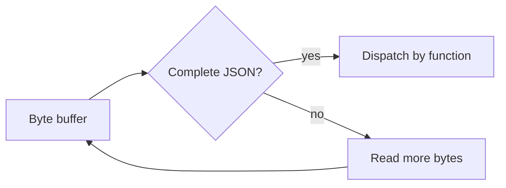

---

## 15. Python test server (developer tool)

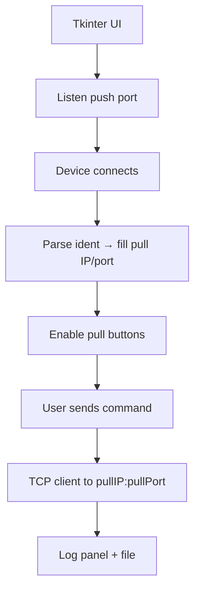

---

## 15a. Component dependency (C4-style)

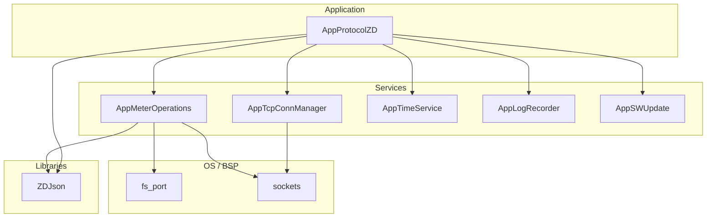

---

## 15b. Packet fragmentation (readout / log / directives)

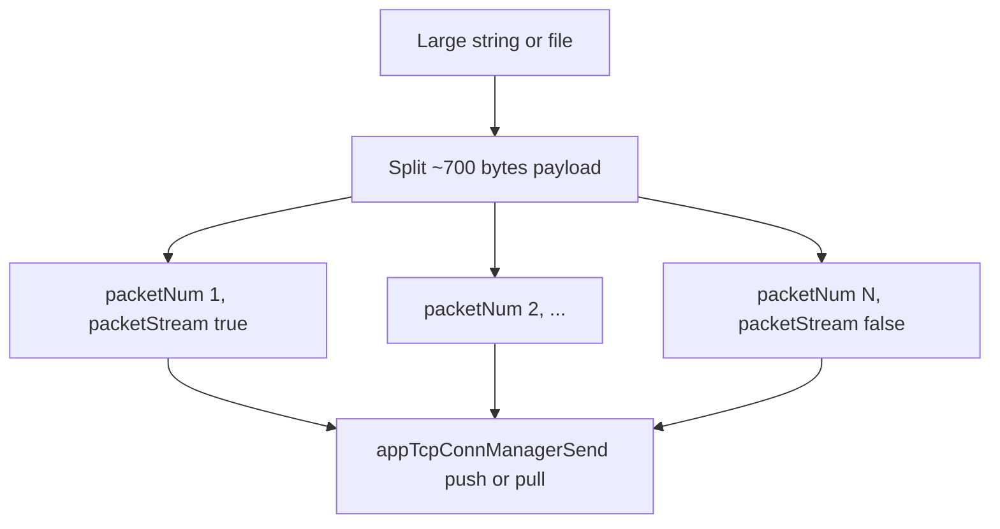

---

## 15c. Meter job internal phases

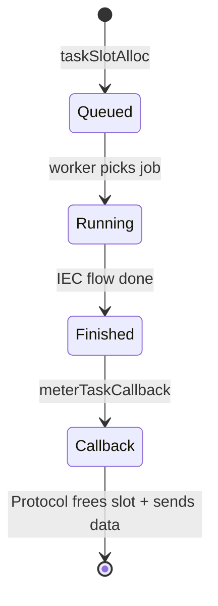

---

## 15d. Test server — ident to pull unlock

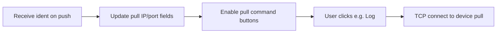

---

## 16. Error and ACK model

| Response | Meaning |
|----------|---------|
| `function: "ack"` | Success |
| `function: "nack"` | Failure / invalid JSON / rejected operation |

Some flows (e.g. alive) tolerate missing server replies; readout data push still deletes local files even if no ack.

---

## 17. Configuration touchpoints (conceptual)

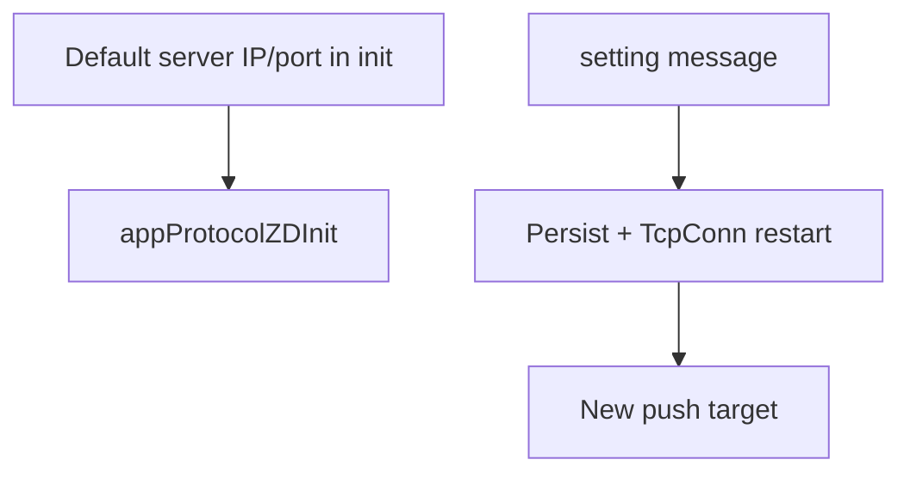

---

## 18. Related documentation pages

| Page | Focus |
|------|--------|
| [Overview](index.html) | Short intro and push/pull table |
| [TCP Connection](tcp-conn.html) | Socket manager APIs, `IncomingMsngCb_t` at start |
| [Meter Operations](meter-operations.html) | Registry and jobs |
| [ProtocolZD](protocolzd.html) | Message dictionary with examples |
| [Test Server](test-server.html) | UI and scenarios |

---

## 19. Glossary

| Term | Meaning |
|------|---------|
| **Push** | Outbound connection from device to head-end |
| **Pull** | Inbound connection to device’s listening port |
| **Ident** | Device announces itself and pull endpoint |
| **Alive** | Periodic keep-alive |
| **Readout** | Meter reading result packaged as JSON |
| **Load profile** | Profile window read from `_payload.txt` |
| **IncomingMsngCb_t** | Callback registered with `appTcpConnManagerStart`; receives `channel`, `data`, `dataLength` for each TCP recv |

---

## 20. Mindmap — `function` field (all channels)

```mermaid
mindmap
  root((Protocol JSON))
    Push from device
      ident
      alive
      readout data
      loadprofile data
    Pull from server
      log
      setting
      fwUpdate
      readout request
      loadprofile request
      directiveList
      directiveAdd
      directiveDelete
    Common responses
      ack
      nack
```

---

## 21. Timeline — typical power-on to steady state

```mermaid
gantt
  title Device boot to steady state (conceptual)
  dateFormat YYYY-MM-DD
  axisFormat %d

  section Network
  TCP start           :a1, 2026-01-01, 1d
  Pull socket up      :a2, after a1, 1d

  section Registration
  Connect push        :b1, after a2, 1d
  Send ident          :b2, after b1, 1d
  Receive register    :b3, after b2, 1d

  section Steady
  Alive every 5 min   :c1, after b3, 3d
```
